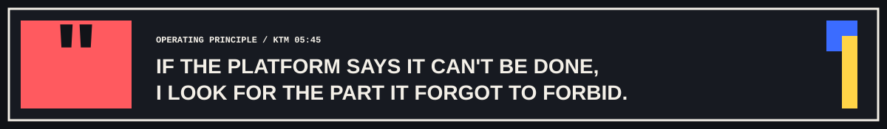
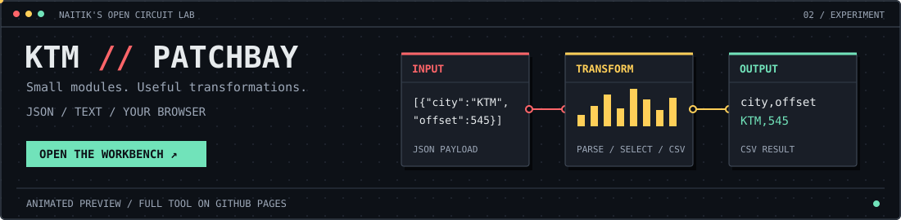

<picture>
  <source media="(prefers-color-scheme: dark) and (max-width: 600px)" srcset="./assets/profile-dark-mobile.svg">
  <source media="(prefers-color-scheme: light) and (max-width: 600px)" srcset="./assets/profile-light-mobile.svg">
  <source media="(prefers-color-scheme: dark)" srcset="./assets/profile-dark.svg">
  <source media="(prefers-color-scheme: light)" srcset="./assets/profile-light.svg">
  
</picture>

 

## About Me

- Studying **BSc (Hons) Computing with Artificial Intelligence** at Islington College.
- Co-founder, Managing Director, and Technical Lead at **Nepal Solution Hub Pvt. Ltd.**
- Building full-stack systems, AI-assisted workflows, dashboards, CMS platforms, and focused developer tools.
- Comfortable taking work from requirements and architecture through implementation, deployment, and maintenance.

<picture>
  <source media="(prefers-color-scheme: dark)" srcset="./assets/quote-dark.svg">
  <source media="(prefers-color-scheme: light)" srcset="./assets/quote-light.svg">
  
</picture>

<a href="https://naitik-joshi.github.io/naitik-joshi/">
  <picture>
    <source media="(max-width: 600px)" srcset="./assets/patchbay-preview-mobile.svg">
    
  </picture>
</a>

## Tech Stack

  

  
  
  
  

<!-- Profile telemetry is generated in this repository. No hosted stats service is required. -->
