<picture>
  <source media="(prefers-color-scheme: dark) and (max-width: 600px)" srcset="./assets/profile-dark-mobile.svg">
  <source media="(prefers-color-scheme: light) and (max-width: 600px)" srcset="./assets/profile-light-mobile.svg">
  <source media="(prefers-color-scheme: dark)" srcset="./assets/profile-dark.svg">
  <source media="(prefers-color-scheme: light)" srcset="./assets/profile-light.svg">
  
</picture>

 

[`PORTFOLIO`](https://naitikjoshi.com.np/) · [`LINKEDIN`](https://www.linkedin.com/in/naitik-joshi-075a45255/) · [`EMAIL`](mailto:naitikjoshi888@gmail.com) · [`CURRENT BUILD`](https://github.com/naitik-joshi/ProdTag)

Generated from authored project metadata and public GitHub signals. Pinned repositories continue the story below.

