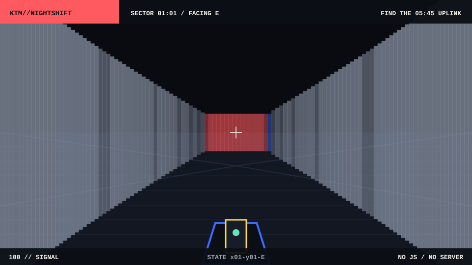

# KTM//NIGHTSHIFT

An original first-person maze compiled into GitHub Markdown. The level contains no runtime game engine: every valid position and facing direction is a pre-rendered SVG connected to the next state with ordinary hyperlinks.

<div align="center">

<a href="./play/x01-y01-E.md"></a>

<h2><a href="./play/x01-y01-E.md">ENTER THE 05:45 RELAY</a></h2>

Find the uplink terminal. Click the viewport to step forward, or use the controls below each frame.

</div>

## Architecture

- Python raycaster with no third-party runtime dependencies.
- One SVG and one Markdown document per `(x, y, heading)` state.
- A finite navigation graph instead of JavaScript, WebAssembly, or a backend.
- Original map, interface, and vector artwork.

Regenerate the complete level with:

```bash
python3 scripts/generate_nightshift.py
```
