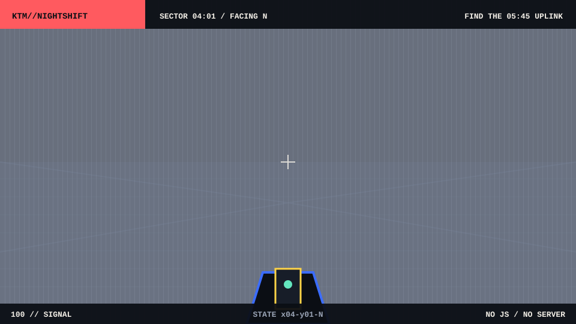

<h1>KTM//NIGHTSHIFT</h1>

<table>
  <tr>
    <td align="center"><a href="./x04-y01-W.md"><strong>A / TURN LEFT</strong></a></td>
    <td align="center"><a href="./x04-y01-N.md"><strong>W / WALL</strong></a></td>
    <td align="center"><a href="./x04-y01-E.md"><strong>D / TURN RIGHT</strong></a></td>
  </tr>
  <tr>
    <td align="center"><a href="../../README.md">RETURN TO PROFILE</a></td>
    <td align="center"><a href="./x04-y01-N.md">S / WALL</a></td>
    <td align="center"><a href="./x01-y01-E.md">RESTART</a></td>
  </tr>
</table>

STATE x04-y01-N // Each move loads another committed Markdown frame. No JavaScript or server.

